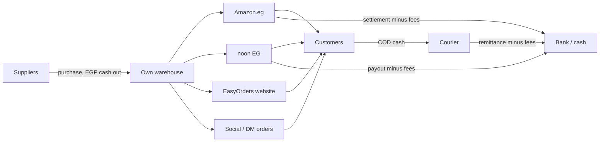
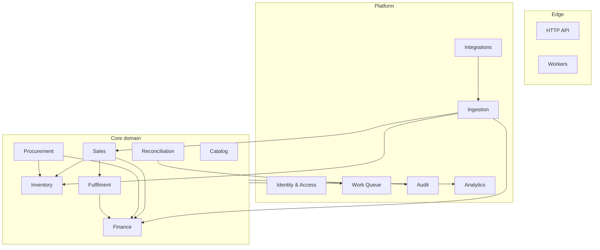
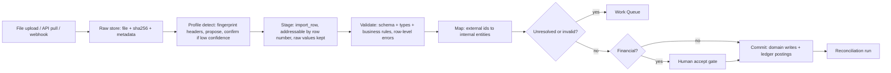
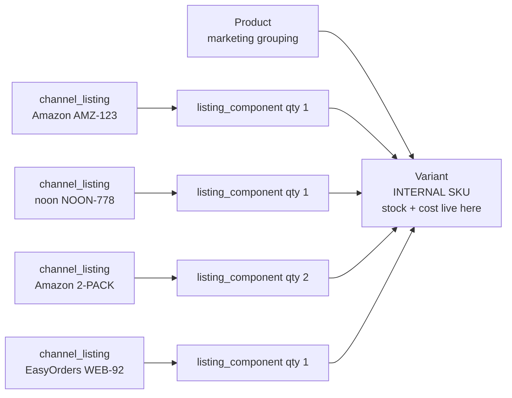

# Commerce Operations Platform — Architecture & Product Discovery

Status: **Discovery / not approved**. No code, no schema migrations, no folder tree yet.
Date: 2026-08-18 · Author: Principal Architect review · Currency: EGP · Timezone: Africa/Cairo

---

## 0. How to read this

Everything below is marked as one of:

| Marker | Meaning |
|---|---|
| **CONFIRMED** | You told me this |
| **ASSUMED** | I chose a safe default so we can keep moving. Cheap to change. |
| **NEEDS BUSINESS ANSWER** | Wrong answer here changes the architecture. Listed in §17. |
| **CHALLENGE** | I think a stated requirement is wrong, incomplete, or solving the wrong problem |

If you read only three sections, read **§3 (hidden requirements)**, **§10 (financial model)** and **§18 (first slice)**.

---

## 1. What I understand the business to be

A multi-channel retail operation in Egypt that **buys finished goods and resells them**. It is not a manufacturer, not a dropshipper, not a service business.



The operating reality that shapes everything:

1. **Money and goods move on different clocks.** A sale on 1 Aug may become cash on 20 Aug (marketplace settlement) or on 12 Aug (courier remittance), net of fees you did not choose and cannot predict exactly.
2. **A large share of orders never become revenue.** COD refusals, failed delivery, RTO (return to origin), cancellations. You still pay shipping both ways.
3. **The numbers live in four different formats** — a marketplace portal, a settlement file, a courier statement, and somebody's head.

The product is therefore **not a dashboard**. A dashboard is the visible 10%. The product is a *reconciled operational ledger* with a dashboard on top. If we build the dashboard first, we will build a beautiful, confidently wrong number generator.

**CHALLENGE — the project name.** "dashboard" undersells and will misdirect the build. Suggest internal name: *Operations Ledger* or similar. Names shape what gets built.

---

## 2. Business goals, restated as testable capabilities

Your questions, translated into what the system must actually be able to do. I have marked how hard each one truly is — this is the most useful table in the document.

| Business question | Real capability required | Difficulty | Depends on |
|---|---|---|---|
| How much cash do we have? | Complete capture of **every** inflow/outflow + bank/wallet reconciliation | **Hard — hardest of all** | Human discipline, not code (§3.1) |
| How much is tied up in inventory? | Costed stock ledger, valuation method, stock at 3rd-party warehouses | Medium | Costing decision (§11) |
| How much did we sell? | Revenue recognition rule; "sold" ≠ "ordered" | Medium | Recognition decision (§10.2) |
| What sells the most? | Order lines resolved to internal variant across all channels | Easy-medium | SKU mapping (§11) |
| What is profitable? | Contribution margin per variant = price − COGS − fees − shipping − returns share | **Hard** | Everything below it |
| What are actual fees/costs? | Settlement/statement ingestion per channel | Medium | File/API ingestion (§9) |
| How much do marketplaces pay us? | Payout tracking + receivable ageing | Medium | Settlement ingestion |
| What do we lose to fees/returns/RTO? | Cost attribution per order/line, incl. failed deliveries | **Hard** | Courier + marketplace data |
| Which channel performs best? | Channel P&L with shared-cost allocation policy | Medium-hard | Allocation rules (§10.6) |
| Which moderators perform best? | Attribution + **controllable** metrics only | Medium | §CHALLENGE below |
| Which orders are problematic? | Order ageing + SLA rules per status | Easy | Order lifecycle |
| What needs attention today? | A unified typed **work queue** | Easy — high value | §7 (Work Queue module) |
| Can we reconcile against marketplaces? | First-class reconciliation runs + discrepancy workflow | **Hard** | §9 |

Note the pattern: **the questions you care most about are the hardest ones**, and they all sit on top of the same two foundations — a costed stock ledger and a money ledger. That is why §10 and §11 get the most space here.

**CHALLENGE — "Which moderators perform best?"** Do not rank moderators by revenue or order count. Both are gameable and mostly reflect *which orders they were assigned*, not their work. Measure what a moderator controls: time-to-first-contact, confirmation rate, delivery success rate on their own orders, reopen/complaint rate. Otherwise you will build a metric that quietly teaches your staff to cherry-pick orders and dodge hard ones. Ranking humans is a product decision with behavioural consequences — treat it as such.

---

## 3. Hidden requirements I found (things nobody asked for, that decide success)

### 3.1 Cash accuracy is a data-completeness problem, not a software problem — **the biggest risk in the project**

"How much cash do we have" is only correct if **100% of money events are recorded**: supplier payments, petty cash, staff salaries, a partner taking EGP 20,000 out of the drawer, a Vodafone Cash transfer, a refund handed to a customer in cash.

No amount of automation fixes an unrecorded withdrawal. What software *can* do:

- Model cash as **accounts** (bank, cash box, InstaPay/Vodafone Cash wallet), never one number.
- Support **statement reconciliation**: import/enter the bank or wallet statement, match against recorded events, and show the **unexplained difference**.
- Treat an unexplained difference as a visible, ageing work item — not a silent adjustment.

**This must be in v1 of the finance slice.** If the first time the owner sees "system cash EGP 812,300" it does not match the bank, they will stop trusting every other number on the screen, permanently. Trust in this product is lost exactly once.

### 3.2 Money-in-transit is a first-class state

Between "customer paid the courier" and "cash in our bank" sits real money you cannot spend and must not double-count. Same for marketplace sales awaiting settlement. The system needs at minimum:

- **COD receivable** (per courier, ageing)
- **Marketplace receivable** (per channel, ageing)

Without these, the cash dashboard is wrong every single day. **ASSUMED** this is a large fraction of your working capital — for a COD-heavy Egyptian operation it usually is.

### 3.3 Failed delivery / RTO is a distinct event, not "a return"

A return happens *after* a completed sale (revenue reverses, goods come back, refund goes out). An RTO means the sale **never happened** — but you still paid outbound and return shipping, and the goods may come back damaged or shrink-wrapped-open. These have completely different accounting and completely different operational meaning. Most homegrown systems conflate them and then cannot explain why margins look fine while the bank account does not.

### 3.4 Every automation needs a named failure destination

"Automate everything" is fine as an ambition and dangerous as an implementation. Rule for this system:

> **No automated process is allowed to fail silently, guess, or fall back to a default. Unknown input becomes a typed work item assigned to a human.**

Unmapped SKU, unknown marketplace status, settlement line we cannot categorise, webhook signature mismatch, courier status we have never seen — all land in the same **Work Queue** (§7). This one rule is what separates "automated" from "quietly corrupt".

### 3.5 Explainability needs a data model, not good intentions

"Every number is explainable" only survives contact with reality if explainability is a *structure*: each figure on screen resolves to a **metric definition** → **ledger postings** → **source event** → **source document (raw file/API payload)**. Design it in from the start; it cannot be retrofitted onto SQL aggregations written ad hoc.

### 3.6 Other requirements implied but unstated

| Hidden requirement | Why it matters |
|---|---|
| Stock held at Amazon/noon warehouses (FBA/FBN) | If you use them, your "inventory" is in ≥3 physical places. Locations must exist from day one. **NEEDS BUSINESS ANSWER** |
| Multi-pack / bundle listings | "2-pack" on Amazon = 2 units of one variant. Modelling a listing as 1:1 to a product makes stock and COGS wrong. Cheap now, very expensive later (§11) |
| Egyptian tax / ETA e-invoicing | Real compliance obligation for Egyptian businesses. Keep tax fields on order lines even if out of scope for v1 |
| Purchase landed cost (customs, freight, clearance) | If you import, unit cost ≠ invoice price. Affects every margin number |
| FX on purchases | If you buy in USD, EGP cost moves with the rate. Cost must be frozen in EGP at receipt |
| Customer confirmation calls | Standard in Egyptian social commerce, likely the moderators' actual main job. It is a real workflow state, not a note field |
| Historical backfill depth | Determines whether opening balances are entered manually or reconstructed |
| Data retention of raw files/payloads | Auditability is worthless if the source is deleted |

---

## 4. Requirements I believe are wrong or incomplete

### 4.1 "Cash goes down when inventory is added"

Correct instinct, imprecise model. What is actually happening:

- Buying stock is **not an expense**. It is converting one asset (cash) into another asset (inventory). Profit does **not** change.
- Profit changes at **sale**, when the cost of *those specific units* becomes COGS.
- The "remaining EGP 750,000" is a **cash balance**, not "cash flow". *Cash flow* is the movement over a period; *cash balance* is the level at a point in time. Both are useful; they are different objects.

So the owner's example is right about the arithmetic and wrong about the category — and that difference is exactly what makes profit reports believable. Full treatment in §10.

### 4.2 "Upload invoices and calculate profit"

**CHALLENGE — mostly the wrong mechanism.**

- Invoices are the *worst* source for profit. They are a legal document, not a data feed: unstructured, per-transaction, and missing fee breakdowns.
- The authoritative sources are **settlement/statement data** (what the marketplace actually paid you and why) and **order data** (what you sold). Both are available as structured files or APIs on Amazon and noon.
- Therefore: **no OCR, no PDF parsing in this system.** If the only path to a number is a PDF, we take the number as a manual entry with a document attached, and never pretend we parsed it.

Which source is authoritative for which field is a design decision, made explicitly in §9.4.

### 4.3 "One product should work across Amazon, noon, social and website"

Right goal. The usual implementation is wrong, in two specific ways:

1. Mapping at the **product** level instead of the **variant** level. Stock and cost live at variant granularity. Colour/size/pack differences are not cosmetic.
2. Assuming a listing maps to **one** variant at **quantity one**. Multi-packs and bundles break this immediately, and retrofitting it means rewriting every historical order line.

Recommendation in §11: a channel listing resolves to **one or more (variant, quantity)** components. Cost today: one extra table. Cost later: a data migration over your entire order history.

### 4.4 "Moderators" as a module

**CHALLENGE.** Moderator is a *role*, not a domain. There is no "moderator data" — there is order assignment, permissions, and performance metrics, which belong to Sales, Identity, and Analytics respectively. Making it a module guarantees leakage of authorization logic into the order domain. Removed from the module list in §7.

### 4.5 The proposed import pipeline

Your pipeline is good and close to right. Three changes (§9):

- **Source detection should be assisted, not magic.** Fingerprint the file, *propose* the profile, require confirmation when confidence is low. Silent misdetection of a settlement file corrupts months of profit numbers before anyone notices.
- **Add an explicit accept/approve gate** between validation and posting for anything financial.
- **Add raw-file immutability + content hashing** before parsing, so reprocessing is safe and duplicate uploads are detected instantly.

### 4.6 "Analytics" as a module built after everything else

Partly wrong. Metric *definitions* are domain knowledge and belong next to the domain that owns them; the analytics module owns delivery (projections, caching, read APIs), not meaning. If "Net Profit" is defined inside the analytics module, finance and analytics will disagree within six months.

---

## 5. Critical assumptions

Each one has a default so work can proceed, plus what breaks if it is wrong.

| # | Assumption | Confidence | If wrong |
|---|---|---|---|
| A1 | Majority of non-marketplace orders are **COD** collected by courier | High | If prepaid dominates, receivable modelling simplifies a lot |
| A2 | Courier remits COD **periodically, net of fees**, with a statement | High | Changes reconciliation cadence only |
| A3 | RTO/failed-delivery rate is material (double digits %) | Medium-high | If low, still model it; just less prominent in UI |
| A4 | All amounts are **EGP**; purchases may originate in USD | Medium | Multi-currency ledger is a much larger build |
| A5 | Single legal entity, single organization | High | Multi-entity consolidation is a different product |
| A6 | Self-fulfilled (MFN / Fulfilled-by-Partner) on both marketplaces initially | **Medium — verify** | FBA/FBN adds locations, fees, reimbursements, separate stock reports |
| A7 | Amazon = amazon.eg only (`ARBP9OOSHTCHU`, EU endpoint, eu-west-1) | Medium | More marketplaces = per-marketplace settlement handling |
| A8 | noon financial data arrives as **downloadable reports**, not API, initially | Medium-high | If API access is granted, ingestion gets easier, model unchanged |
| A9 | "Posta API" = **Bosta** (Egyptian courier, documented REST API + webhooks) | **Low — verify** | Different courier = different adapter; abstraction absorbs it |
| A10 | Order volume is hundreds/day, not tens of thousands | High | Postgres + projections is correct at this scale; would revisit at 10k+/day |
| A11 | Team is 1–3 engineers, mostly mid-level | High | Drives every "prefer boring" call in this document |
| A12 | Tax/ETA e-invoicing is **out of scope for v1** but must not be designed out | Medium | If in scope, tax modelling becomes a slice of its own |

---

## 6. Domain model

### 6.1 The one architectural idea that matters

> **Three append-only ledgers, plus projections. Nothing important is a mutable number.**

| Ledger | Records | Answers | Never |
|---|---|---|---|
| **Stock ledger** (`stock_movement`) | every unit in/out with reason + cost snapshot | on-hand, inventory value, stock history | UPDATE a movement |
| **Financial ledger** (`ledger_entry`) | double-entry postings generated by named rules | cash, receivables, revenue, COGS, fees, profit | UPDATE a posting |
| **Audit log** (`audit_event`) | who did what, before/after, why | accountability | UPDATE an entry |

Everything else — stock levels, account balances, dashboards — is a **projection**: derived, rebuildable, cacheable, never authoritative. Corrections are *new entries that reference what they correct*, never edits.

This single decision buys the four properties you asked for (correctness, traceability, reconciliation, auditability) and costs perhaps two extra weeks up front. Retrofitting it later costs a rewrite plus a data migration you cannot validate, because the history needed to validate it was never recorded.

**What this is NOT:** it is not event sourcing for the whole system. Orders, products and users are ordinary mutable rows with an audit trail. Only stock and money are ledgers, because only stock and money need to be provably reconstructible.

### 6.2 Core entities (~28 tables, not hundreds)

```
Identity          organization · user · role · permission · role_permission · user_role · session
Catalog           product · variant · channel_listing · listing_component · sku_mapping_candidate
Inventory         location · stock_movement · stock_level(proj) · stock_count · stock_count_line
Procurement       supplier · purchase_order · purchase_receipt · purchase_receipt_line
Sales             customer · order · order_line · order_status_history · order_assignment
Fulfilment        shipment · shipment_line · shipment_event · courier_account
Finance           account · ledger_entry · ledger_transaction · expense · payout · payout_line
Ingestion         channel_account · inbound_event · import_batch · import_row · source_document
Reconciliation    reconciliation_run · discrepancy
Work              work_item
Audit             audit_event
```

Deliberately **absent** for now: invoices, tax records, GL periods/closing, ad spend, forecasting, customer accounts/loyalty, warehouse bin locations. Each is a real thing; none belongs in v1.

### 6.3 Cross-cutting conventions (decide once, apply everywhere)

| Concern | Decision |
|---|---|
| Money | `bigint` **minor units (piastres)** + explicit currency code. Never floats. Rounding rules named and centralised |
| Time | Store UTC. Render Africa/Cairo. **Business day boundary defined explicitly** — a "daily sales" figure is meaningless without it |
| IDs | UUIDv7 (sortable, safe to expose, no cross-tenant enumeration) |
| Tenancy | `organization_id` on every business table from day one (§13) |
| External refs | Always store `external_id` + `raw_payload` alongside the mapped value |
| Unknown values | Never default. Create a `work_item` (§3.4) |
| Deletes | Soft-delete or forbidden for anything referenced by a ledger |

---

## 7. Module boundaries

Modular monolith, one deployable, two process roles (HTTP + worker) from one image.



Changes from your proposed list:

| Change | Reason |
|---|---|
| **Removed** `Moderators` | A role, not a domain (§4.4) |
| **Split** `Orders` → `Sales` + `Fulfilment` | Shipping has its own lifecycle, providers and failure modes. Coupling them means a courier change touches order code |
| **Added** `Procurement` | Purchases are where inventory cost is born. Without it, COGS has no origin |
| **Added** `Work Queue` | The home for all automation fallout and "what needs attention today" |
| **Split** `Imports` → `Ingestion` + `Reconciliation` | Getting data in and proving it agrees are different problems with different owners |
| `Integrations` = **connectors only** | Provider SDKs, credentials, sync scheduling, health. Zero business logic |

**Dependency rule:** Core domain modules may not import from `Integrations`. Data flows inward through `Ingestion` as canonical DTOs. If `sales` ever imports an Amazon type, the boundary has failed.

---

## 8. Integration architecture

### 8.1 Adapter contract (every connector, without exception)

```
pullIncremental(since)   → canonical DTOs        // normal operation
pullRange(from, to)      → canonical DTOs        // backfill + repair sweep
handleWebhook(payload)   → inbound_event         // real-time, if provider supports
healthCheck()            → status
```

**Two non-negotiable rules:**

1. **Never trust webhooks alone.** Every webhook-driven source also runs a nightly `pullRange(last N days)` repair sweep. Webhooks get lost, retried out of order, and silently disabled. The sweep is what makes the data *eventually correct* instead of *usually correct*.
2. **Persist raw first, process later.** Inbound webhook → verify signature → store `inbound_event` (raw payload + dedup key) → return 200 immediately → process asynchronously. This gives replay for free and keeps provider timeouts from becoming data loss.

### 8.2 Provider matrix (from current documentation, Aug 2026)

| Source | Mechanism | What is available | What is NOT | Recommendation |
|---|---|---|---|---|
| **EasyOrders** | Webhooks (`order created`, `order status change`) + REST public API; `secret` header on callbacks | Full order payload incl. customer, address, cart items with variants, totals, payment method | Financial settlement (there is none — you collect via courier) | **Webhook-primary + nightly sweep.** Easiest, highest value → first integration |
| **Amazon SP-API** | REST + Notifications (EventBridge/SQS) + Reports (async) + Data Kiosk (GraphQL) | Orders API; `ORDER_CHANGE` notifications; **Settlement report `GET_V2_SETTLEMENT_REPORT_DATA_FLAT_FILE_V2`**; Finances API `listTransactions` (v2024-06-19, needs *Finance and Accounting* role); FBA inventory reports; seller economics via Data Kiosk | Buyer PII without approved restricted role + Restricted Data Token. Settlement reports are **generated by Amazon on their schedule** — you cannot force a settlement period | **Notifications + Orders API for operations; settlement report V2 as the authoritative money source.** Register as a *private* (self-authorised) app first |
| **noon** | Partner APIs (Content, Stock, Pricing, Offer, FBPI orders w/ webhooks, async bulk export) + Seller Lab report downloads | Catalog, stock, pricing, offer status; order/fulfilment via FBPI if enrolled; asynchronous report generation + download | Much of Seller Lab remains unexposed; several FBPO operations undocumented. API access depends on your enrolment | **Hybrid: file import for finance from day one, API for catalog/stock/orders when access is confirmed.** Same canonical model either way |
| **Courier (Bosta assumed)** | REST API + webhooks; API key from dashboard | Create delivery, track, AWB print, status webhooks, COD amount | Remittance statements typically portal downloads | **API for shipments, file/manual import for remittance reconciliation** |

Notes worth knowing:

- Amazon's older settlement reports (`..._FLAT_FILE` and `..._XML`) are **deprecated and unavailable to sellers from 25 March 2026**. Build against V2 only.
- `ORDER_CHANGE` notifications **do not carry full order detail** — they are a trigger to call the Orders API. Budget rate limit accordingly.
- Amazon announced SP-API developer fees for 2026 and then **cancelled the programme in May 2026**; self-use private apps were exempt regardless. Do not architect around fees, but keep call volume efficient — the intent to monetise was real, and it matters more if you productize (§13).
- Egypt marketplace: `ARBP9OOSHTCHU`, endpoint `sellingpartnerapi-eu.amazon.com`, region `eu-west-1`. **Verify against official docs at implementation time.**

### 8.3 Status mapping

Provider status → canonical status is a **mapping table with an explicit `UNKNOWN` outcome**. An unrecognised status must create a work item, never silently map to the nearest guess. Store the raw external status permanently alongside the mapped one.

---

## 9. Ingestion, import and reconciliation architecture

### 9.1 Pipeline (revised from your proposal)



Additions to your version, and why each earns its place:

| Stage | Why |
|---|---|
| Content hash before parse | Instant duplicate detection; safe reprocessing; the file is the evidence |
| Profile **version** recorded | Providers change columns without notice. When they do, you need to know which rows were parsed with which map |
| Row-level staging | Partial failure must mean "3 of 400 rows need attention", never "import failed" |
| Human accept gate on financial imports | Automation posts to the ledger only after someone accepts. Ledgers are append-only; a bad auto-post is expensive to unwind |
| Deterministic natural key per row | Reprocessing **supersedes** rows, never duplicates them. This is what makes re-import safe |

### 9.2 Idempotency keys

| Data | Natural key |
|---|---|
| Order | `(channel_account_id, external_order_id)` |
| Order line | `(order_id, external_line_id \|\| line_index)` |
| Settlement line | `(channel_account_id, settlement_id, external_line_id)` |
| Stock movement | `(source_type, source_id, variant_id, location_id)` |
| Inbound webhook | `(provider, event_id)` or content hash |

### 9.3 The automation ladder

Not everything should sit on the same rung. Assign each workflow deliberately:

| Rung | Meaning | Applies to |
|---|---|---|
| 1 Observe | System records, human decides | Bank/wallet reconciliation, discrepancy resolution |
| 2 Suggest | System proposes, human confirms | SKU mapping, profile detection, reorder suggestions |
| 3 Auto + review gate | System does it, human accepts before it counts | Settlement import → ledger posting |
| 4 Auto + exception | System does it; only failures surface | Order ingestion, shipment status sync, stock movements from orders |
| 5 Fully auto | Silent | Projections, caches, notifications |

Nothing financial starts above rung 3. Things move up the ladder once the error rate is measured, not because they feel safe.

### 9.4 Source authority (answers "which report is authoritative?")

| Field | Authority | Why |
|---|---|---|
| What was ordered | Channel order API/report | Closest to the transaction |
| What we shipped / delivered | Courier (self-fulfilled) or channel (marketplace-fulfilled) | Whoever moved the box |
| **Fees and net payout** | **Settlement / statement file** | The only source that says what the marketplace actually kept |
| Marketplace-held stock | Channel inventory report | We cannot see their warehouse |
| Own-warehouse stock | Our stock ledger, corrected by physical count | Physical count wins over everything |
| Unit cost / COGS | Our purchase receipts | The channel has no idea what you paid |

Where sources disagree, the authority wins and the disagreement becomes a **discrepancy**, not a silent overwrite.

### 9.5 Reconciliation as a first-class concept

`reconciliation_run` (scope: channel + period + type) → produces `discrepancy` records → each is a work item with a resolution action and an audit trail.

Three planes:

1. **Order plane** — internal orders vs channel order report: missing, extra, quantity/price mismatch, unmapped SKU.
2. **Money plane** — expected net (revenue − expected fees) vs actual settlement deposit: fee variance, unexpected deductions, missing payouts, duplicate credits.
3. **Stock plane** — internal on-hand vs channel inventory report vs physical count: shrinkage, unrecorded returns, mapping errors.

Plus one internal check nightly: **stock ledger valuation must equal the Inventory account balance in the financial ledger.** If those two drift, something is broken upstream and every profit number is suspect. This check is cheap and will save you repeatedly.

Design details that decide whether people actually use it: **tolerance thresholds** (±EGP 1 rounding is noise, not a discrepancy), **severity**, **ageing**, and resolution options *accept / adjust / map / ignore-with-reason* — where "ignore" requires a reason and is itself audited.

---

## 10. Financial model

### 10.1 Decision: how do we guarantee financial correctness?

| Option | Description | Verdict |
|---|---|---|
| A. Derived-only | Compute everything from orders/purchases with SQL | Rejected. Cannot represent cash, fees not tied to orders, adjustments, corrections. Every report becomes a bespoke query nobody can verify |
| B. Balance columns | `cash_balance`, `inventory_value` updated by services | **Rejected outright.** Guaranteed to drift, impossible to audit, unrecoverable when it does |
| C. **Minimal double-entry ledger** | Small chart of accounts; postings generated by named rules from domain events; every balance = SUM(entries) | **Recommended** |

**Why C, given "do not build accounting software":** double-entry is not accounting software — it is a 500-year-old *data structure* with a built-in integrity check (debits = credits). It is the cheapest way to make every number explainable and every balance reconstructible. Option A is what actually becomes a fake accounting system: a growing pile of aggregation queries that disagree with each other.

**Trade-off:** the team must learn ~10 postings. Mitigations: the ledger is an internal implementation detail; there is **no accounting UI**; users see business events ("Purchase received", "Order delivered", "Payout received"); each posting is produced by one named, tested `PostingRule`.

**Revisit if:** an accountant joins and wants real GL features (periods, closing, tax ledgers) — then integrate with real accounting software and keep this as the operational source feeding it.

### 10.2 Recognition rules — **NEEDS BUSINESS CONFIRMATION**, biggest single decision

| Event | Recommended recognition point | Rationale |
|---|---|---|
| Revenue (COD) | **On delivery** | Before delivery there is no sale; RTO rates make order-time recognition badly wrong |
| Revenue (prepaid / marketplace) | On dispatch, or channel's own point if the settlement uses it | Match the settlement so reconciliation is possible |
| COGS | Same moment as its revenue | Matching. Never a period-end estimate |
| Marketplace fees | Accrue estimate at sale, **true up at settlement** | You need same-day margin visibility; settlement is truth |
| Shipping cost | When the courier bills it, incl. **RTO legs** | RTO shipping is a real cost with no revenue |
| Purchases | On **receipt** of goods, not on order or payment | Cost enters inventory when the goods do |

**Recognising revenue at order creation would overstate sales by your entire RTO+cancellation rate.** In Egyptian COD commerce that is frequently 20–40%. This is the number one way this project could produce confidently wrong dashboards.

### 10.3 Chart of accounts (~20 accounts, complete)

```
ASSETS        Cash-Bank · Cash-Box · Wallets · Inventory
              COD-Receivable-Courier · Marketplace-Receivable · Supplier-Prepayment
LIABILITIES   Accounts-Payable · Refunds-Payable
EQUITY        Owner-Capital · Owner-Drawings · Retained-Earnings
INCOME        Product-Revenue · Shipping-Revenue
EXPENSES      COGS · Marketplace-Fees · Payment-Fees · Shipping-Cost
              RTO-Cost · Inventory-Writeoff · Marketing · Salaries · Other-Opex
```

### 10.4 Worked example — your EGP 1,000,000, followed all the way through

| # | Event | Debit | Credit | Cash | Inventory | Profit |
|---|---|---|---|---|---|---|
| 1 | Owner puts in capital | Cash-Bank 1,000,000 | Owner-Capital 1,000,000 | 1,000,000 | 0 | 0 |
| 2 | Buy stock, paid | Inventory 250,000 | Cash-Bank 250,000 | 750,000 | 250,000 | **0** |
| 3 | Order delivered, COD 4,000 (cost 2,500) | COD-Receivable 4,000 / COGS 2,500 | Product-Revenue 4,000 / Inventory 2,500 | 750,000 | 247,500 | **+1,500** |
| 4 | Courier remits, keeps 60 fee | Cash-Bank 3,940 / Shipping-Cost 60 | COD-Receivable 4,000 | 753,940 | 247,500 | **+1,440** |
| 5 | RTO: delivery fails, goods return, courier bills 90 | Inventory 2,500 / RTO-Cost 90 | COGS 2,500 / Cash-Bank 90 | 753,850 | 250,000 | **−90** on that order |

Read row 2 carefully: **buying stock did not change profit.** Read rows 3–4: **the sale created profit before it created cash.** Read row 5: **a failed delivery costs real money and produces no revenue.** Those three facts are the entire reason for this design, and they are exactly what a spreadsheet gets wrong.

### 10.5 Balances vs transactions vs metrics

| Concept | Represented as |
|---|---|
| Cash, inventory value, receivables, payables | **Balance** = SUM of ledger entries on that account. Never stored as a column |
| Purchase, sale, payout, fee, refund, adjustment, expense | **Transaction** = immutable set of balanced postings |
| Revenue, COGS, gross profit, contribution margin, net profit | **Calculated metric** over a period, from postings |
| Margin by product/channel, top sellers, return rate, moderator stats | **Derived analytics** on projections |

### 10.6 The metric that actually matters

Not net profit — **contribution margin per variant per channel**:

```
CM = net revenue − COGS − marketplace fees − payment fees
     − outbound shipping − (RTO cost × RTO rate) − returns cost
```

This is the number that tells you what to buy more of, what to stop selling, and which channel deserves attention. Net profit (CM − operating expenses) is a monthly executive number; CM is a daily decision-making number. Note it requires an **allocation policy** for shared costs — write the policy down, show it in the UI, and never let it be implicit.

---

## 11. Product, SKU and inventory model

### 11.1 Identity



- **Variant is the atomic unit.** Internal SKU, stock, cost, reorder point all attach here. One variant, one truth.
- **Channel listing** = one sellable thing on one channel account, holding all its external identifiers (SKU, ASIN, partner SKU, barcode) and its own price/status.
- **Listing component** = how a listing resolves to variants and quantities. Handles single items, multi-packs and bundles with the same mechanism, from day one.
- **Product** is grouping/presentation only. It may carry no logic at all — that is fine and intentional.

### 11.2 Mapping workflow (answers "SKU mapping failures")

An order line whose external SKU is unknown must **never** be dropped and **never** auto-create a product. Instead:

1. Order line is persisted with `external_sku` and `resolution_state = UNRESOLVED`.
2. A `work_item` of type `SKU_MAPPING` is created, with a suggested match (exact barcode > fuzzy title > none).
3. The order is visible and workable by moderators; it is excluded from inventory and margin figures and **flagged as excluded**.
4. On mapping, the line resolves and the deferred stock/financial effects are applied — with the mapping recorded in the audit log (who mapped what to what, and when).

Point 3 is the important one: partial data must degrade **visibly**, not silently.

### 11.3 Inventory

- `location`: Own-Warehouse, Amazon-FC, noon-FC, In-Transit-to-Channel, Customer-Returns-Holding. Even if you have one warehouse today, locations cost nothing now and are painful to add later.
- `stock_movement`: `(variant, location, qty ±, reason, source_type, source_id, unit_cost_snapshot, actor, occurred_at)`.
- Reasons (closed set, extensible): `PURCHASE_RECEIPT`, `SALE`, `RETURN_RESTOCK`, `RTO_RESTOCK`, `DAMAGE`, `LOSS`, `COUNT_ADJUSTMENT`, `TRANSFER_IN/OUT`, `CHANNEL_TRANSFER`.
- On-hand = SUM(qty). `stock_level` exists only as a fast projection.
- **Reservation**: separate from on-hand. Confirmed-but-unshipped orders reserve stock. Available = on-hand − reserved. Skipping this causes overselling within days.

### 11.4 Decision: inventory costing method

| Option | For | Against |
|---|---|---|
| **Moving weighted average (WAC)** | Simple, explainable to non-accountants, stable margins, no lot tracking | Blurs the effect of a price jump across old and new units |
| FIFO with cost layers | Sharper per-sale margin, better under EGP devaluation and rising import costs | Layer consumption logic, harder to explain, harder to correct retroactively |
| Standard cost | Trivial | Wrong. Do not |

**Recommended: moving weighted average per (variant, location)**, recomputed on each receipt, with the **unit cost snapshotted onto every outbound movement at the time it occurs.**

That snapshot is the crucial part: it makes historical COGS **immutable**. A backdated purchase correction changes future costing, never past reported profit. Systems that recompute COGS on read will silently restate last month's profit every time someone edits an old purchase — and nobody notices until an owner asks why a closed month changed.

**Revisit if:** import prices swing so hard within a period that WAC hides real margin damage. The movement-based design lets you move to FIFO later without rewriting history.

---

## 12. Authorization model

**Requirement restated:** not "moderator vs admin", but *"we will invent new roles we cannot predict, and we must never leak financial data to the wrong person."*

### Decision

| Option | Verdict |
|---|---|
| Role checks in controllers (`if (user.role === 'admin')`) | Rejected. Authorization ends up scattered across controllers, services and UI; adding a role means auditing the whole codebase |
| Full ABAC / policy engine (OPA, Cedar) | Rejected for now. Real power, real operational cost, no current requirement justifies it |
| **Permission-based RBAC with scope rules, enforced in the application layer** | **Recommended** |

Shape:

- `permission` = `resource:action` (`order:read`, `order:assign`, `finance:read`, `import:approve`, `sku_mapping:write`) — **data, not code**.
- `role` = a named bundle of permissions. Admin and Moderator are seed data, not enum branches. New roles are configuration.
- **Scope** answers "which rows", separately from "which actions": `ALL` | `ASSIGNED_TO_ME` | `OWN_LOCATION`. A moderator has `order:read` scoped to `ASSIGNED_TO_ME`.
- Enforcement lives in the **application service / query layer**, not controllers. Every list query goes through a scope filter that cannot be forgotten — make the unscoped query the one that requires explicit opt-in.
- The UI **never decides** permissions. It fetches the user's effective capabilities and renders accordingly. UI conditionals are ergonomics, never security.
- Field-level protection matters here: a moderator viewing an order must not receive cost or margin fields **in the API response**. Hiding them in the frontend is not hiding them.

**Revisit if:** you need per-customer or per-supplier delegated access, or genuine attribute-based rules — then introduce a policy engine behind the same interface.

---

## 13. Future productization

### Decision: which tenancy concepts exist from day one?

| Concept | Include now? | Reasoning |
|---|---|---|
| **Organization** | **Yes** | `organization_id` on every business table. Costs a column and a query filter now; retrofitting it into a live financial database is a multi-week, high-risk migration where a single missed filter leaks one customer's finances to another |
| **Channel Account** | **Yes** | Needed on day one regardless of SaaS — you have multiple channels and may have multiple seller accounts. This is the natural place for credentials, sync state and health |
| **Location** | **Yes** | Physical reality (§11.3) |
| Workspace | **No** | A layer between org and data with no current meaning. Pure speculation |
| Store | **No** | Redundant with Channel Account. Two names for one thing is how models rot |

**Isolation strategy:** shared schema + `organization_id` + enforced row scoping in the data-access layer, with Postgres RLS as a second line of defence when you actually onboard a second tenant. Not schema-per-tenant, not database-per-tenant — both are premature and both make migrations and cross-tenant analytics painful at this scale.

**Explicitly NOT building:** billing, subscriptions, self-service onboarding, tenant provisioning automation, per-tenant customisation. New tenants are created by an engineer running a script until there is a reason for anything more.

**The real productization risk is not technical.** It is that the moment you serve another business, your Amazon integration stops being a private self-authorised app and becomes a **third-party developer application**: Amazon developer registration, app review, the Data Protection Policy, PII handling obligations and possible audits — plus a demonstrated willingness by Amazon to charge developers for API access (announced for 2026, cancelled May 2026). Budget months, not days, for that transition, and do not promise it to anyone before validating it.

---

## 14. Stack decisions

### 14.1 NestJS vs Hono — **Recommend NestJS**

| Criterion | NestJS | Hono | Weight here |
|---|---|---|---|
| System size (~12 modules) | Enforced module structure | You design it yourself | **High** |
| Integrations & adapters | DI makes swapping/mocking providers natural | Manual wiring | **High** |
| Authorization | Guards + interceptors, one obvious place | Middleware, your own conventions | **High** |
| Background jobs | First-class BullMQ integration, schedulers, shared DI with HTTP layer | Bring your own, separate process wiring | **High** |
| Validation | Standard pipe + DTO pattern | Excellent (Zod-first), arguably nicer | Medium |
| Testing | Testing module, DI substitution | Simple functions, easy to test | Medium |
| Team level (junior→mid) | Conventions remove decisions | Freedom becomes inconsistency | **High** |
| Performance / cold start | Heavier | Much lighter, edge-capable | **Low — irrelevant** |
| Boilerplate | Real, and annoying | Minimal | Medium |

**Why:** this system's difficulty is *organisational* — many modules, many providers, heavy background processing, strict authorization — not *latency*. Hono's real advantages (tiny footprint, edge runtimes, cold-start speed) buy nothing here; your workload is queue workers and multi-statement Postgres transactions. NestJS's conventions are worth the boilerplate for a small, mixed-seniority team that will maintain this for years.

**Trade-offs accepted:** decorator/DI magic has a learning curve; slower startup; more ceremony per endpoint; occasional fighting with the framework on unusual wiring.

**Change the decision if:** the backend becomes a thin BFF over other services; you go edge/serverless-first; or the team becomes one senior engineer who prefers explicit composition — then Hono + Zod + a hand-written composition root is a perfectly good answer.

**Mitigation that makes this reversible:** keep the domain (entities, posting rules, costing, reconciliation) in **framework-free TypeScript**. Nest supplies HTTP, DI and jobs — it should not appear in your ledger logic. Do this and swapping frameworks is a week, not a rewrite. This is the more important lesson than the choice itself.

### 14.2 Supporting decisions (compact)

| Decision | Recommendation | Why / trade-off |
|---|---|---|
| Database | **PostgreSQL**, single instance | Transactions, `numeric`, JSONB for raw payloads, window functions for ledgers. Nothing here needs anything else |
| ORM | **Drizzle** (Prisma acceptable) | SQL-first suits ledger/aggregation work and explicit migrations. Prisma is more ergonomic but fights you on complex reporting SQL. Low-risk either way |
| Repositories | Only around **ledger + inventory** invariants | Wrapping every table in a repository is ceremony without benefit |
| Jobs | **BullMQ + Redis**, same image, worker process role | Mature, observable, good enough. Job status must be visible in the admin UI — operators need to see failed syncs |
| Raw file storage | S3-compatible object storage (or a volume + a documented path to S3) | Raw files are evidence; keep them out of Postgres |
| Frontend | **Next.js**, pure client of the Nest API | One authority for business rules. Do not let the frontend talk to the DB, ever |
| Auth | httpOnly cookie sessions | Simpler and safer than JWT-in-localStorage for a single-app product |
| Analytics storage | Postgres tables + materialized views + scheduled refresh | **No warehouse.** At hundreds of orders/day this is correct for years |
| Deployment | Docker Compose → single VPS or managed platform; GitHub Actions CI | No Kubernetes. It would be the most expensive decision on this list |
| Observability | Structured logs (pino) + correlation IDs + Sentry + an **integration health page** | The health page is a product feature, not ops garnish |

### 14.3 Three kinds of "log" — keep them separate

| Kind | Audience | Storage | Retention |
|---|---|---|---|
| Application logs | Engineers | stdout → log aggregator | Days–weeks |
| Domain events | The system | Postgres, drives projections/side effects | Long |
| **Audit events** | Business, auditors | Postgres, immutable, queryable in the UI | **Years** |

Audit entries carry `actor` (user \| integration \| system-job), `action`, `entity`, `before/after`, `reason`, `correlation_id`. Do not try to derive audit from application logs — that is how you end up unable to answer "who changed this price".

---

## 15. Recommended implementation strategy

Vertical slices. Each one goes domain → persistence → application → API → UI → tests → **used by a real person in real work**. A slice is not done when it is merged; it is done when someone's day got easier.

| # | Slice | Proves | Business value on day one |
|---|---|---|---|
| **1** | **Order intake → product resolution → assignment → moderator workflow → audit** | Tenancy, catalog identity, canonical order model, adapter pattern, webhook ingestion + idempotency, authorization + scoping, stock movements, work queue, audit | Staff stop tracking orders in WhatsApp/sheets |
| 2 | Procurement + cash: suppliers, purchase receipts, costing, financial ledger, cash/inventory dashboard | Double-entry ledger, WAC costing, posting rules, cash reconciliation | "How much cash, how much inventory" — answered and reconcilable |
| 3 | Shipping: courier adapter, shipment lifecycle, COD receivable, delivery-driven revenue + COGS, RTO handling | Provider abstraction #2, recognition rules, receivables | Real revenue and real margin, per order |
| 4 | Amazon: orders + notifications + settlement V2 import + reconciliation | File ingestion, settlement mapping, discrepancy workflow | Actual marketplace fees, actual payouts |
| 5 | noon: report import + API where available | The ingestion model generalises (or exposes where it does not) | Second marketplace, same numbers |
| 6 | Analytics consolidation + contribution margin + "what needs attention today" | Metric definitions, projections, explainability drawer | The dashboard you originally asked for |

Slice 6 being **last** is deliberate. The dashboard is the easiest part and the most dangerous to build first — a dashboard built on incomplete foundations produces numbers people believe.

Slice 1 intentionally handles stock quantities without costs. Cost snapshots are added in slice 2 and backfilled — safe precisely because movements are append-only rows with stable IDs.

---

## 16. Highest-risk decisions

Ranked by (cost of being wrong × difficulty of reversing).

| # | Decision | Risk | Mitigation |
|---|---|---|---|
| 1 | **Revenue recognition + COD/receivable modelling** | Every financial number wrong, invisibly, forever | Confirm with owners in writing before slice 3. Worked example in §10.4 |
| 2 | **Ledger vs derived metrics** | Irreversible once months of data exist without postings | Decide before slice 2. Recommendation: ledger (§10.1) |
| 3 | **Costing method + immutable COGS snapshots** | Silent restatement of closed periods; destroys trust | Snapshot cost on every outbound movement (§11.4) |
| 4 | **Product identity granularity + listing components** | Full order-history migration if wrong | Variant-level + components from day one (§11.1) |
| 5 | **`organization_id` from day one** | Brutal migration; cross-tenant data leak risk | One column now (§13) |
| 6 | **Marketplace-held inventory (FBA/FBN)** | Stock and value both wrong; discovered late | Answer Q2 in §17 before slice 2 |
| 7 | Amazon integration path (private vs published app) | Blocks productization; PII/RDT approval is slow | Start private; investigate published-app requirements early if SaaS is real |
| 8 | Cash event completeness | Cash dashboard drifts, all trust lost | Reconciliation + visible unexplained difference (§3.1) |

---

## 17. Highest-value unanswered questions

For business owners. Each has my default so nothing is blocked — but wrong defaults on Q1–Q4 are expensive.

| # | Question | My default if unanswered |
|---|---|---|
| **1** | **How does money actually reach you?** Per channel: who collects, when do you receive it, what is deducted, and what statement do you get? Rough % of orders that are COD? | COD-dominant; courier remits weekly net of fees; marketplaces settle biweekly net of fees |
| **2** | **Do you hold stock at Amazon (FBA) or noon (FBN/FBP), or do you ship everything yourself?** | Self-fulfilled everywhere; single own warehouse |
| **3** | **What is your realistic RTO / failed-delivery / cancellation rate?** Order-time revenue recognition is wrong if it is material | Material (>15%); recognise revenue on delivery |
| **4** | **Is "Posta" = Bosta, or Egypt Post, or another courier?** Do you use more than one? | Bosta (documented REST API + webhooks); abstraction handles the rest |
| **5** | Do you have API access today? SP-API developer registration; noon Partner API credentials; EasyOrders public API key; courier API key | Only EasyOrders + courier available now; marketplaces start as file imports |
| **6** | Do you sell multi-packs or bundles anywhere? | Yes — modelled from day one regardless |
| **7** | Purchases: local EGP suppliers or imports in USD? Customs/freight to add to unit cost? | Local EGP; landed cost supported but unused |
| **8** | Which cash locations exist? Bank accounts, cash box, InstaPay / Vodafone Cash? Who can move money? | One bank + one cash box + one wallet |
| **9** | What do moderators actually do all day? Do they call customers to confirm orders before shipping? | Yes — confirmation is a real order state |
| **10** | How far back must historical data be loaded? | No backfill; opening balances entered manually at go-live |
| **11** | Returned goods: restock, discount, or write off? Who decides? | Restock if sellable; write-off requires admin approval |
| **12** | Is Egyptian ETA e-invoicing a requirement for this system? | Out of scope for v1; tax fields preserved on order lines |
| **13** | Orders per day today, and expected in 12 months? | ~100–500/day; Postgres + projections, no warehouse |

---

## 18. Proposed first vertical slice

### Slice 1 — "One order, end to end, correctly"

**Scope:** an order arrives (EasyOrders webhook, or created manually for social orders) → resolves to internal variants → an admin assigns it to a moderator → the moderator confirms and progresses it through its lifecycle → stock moves → every step is audited → anything the system cannot resolve becomes a work item.

**Explicitly out of scope:** all money (no ledger, no COGS, no fees), Amazon, noon, courier API, analytics beyond two counters.

**Why this slice:**

- It is **used in real work on day one** — the moderators' actual job — so we get honest feedback within a week rather than opinions about a mockup.
- It exercises the **six decisions that are hardest to reverse**: tenancy scoping, catalog identity + listing components, canonical order model behind an adapter, idempotent ingestion, permission + scope authorization, append-only movements and audit.
- It **defers the two decisions that need business answers** (recognition rules, costing) without being blocked by them.
- It is small enough to throw away. Nothing in it commits us to a financial model.

**Definition of done — the checks that actually matter:**

1. Replaying the same EasyOrders webhook 5 times produces exactly one order and one set of stock movements.
2. A moderator hitting the orders API receives **only** their assigned orders — verified by an automated test that calls the API directly, not by checking the UI.
3. An order line with an unknown external SKU still creates a workable order, plus a `SKU_MAPPING` work item, and is visibly excluded from stock figures.
4. An unrecognised external status creates a work item instead of mapping to a guess.
5. The full history of one order — assignment, every status change, actor, timestamp, source — is readable in the UI by an admin.
6. On-hand stock is computed from movements, never from a stored counter, and a projection rebuild reproduces the identical number.
7. A raw copy of every inbound webhook payload is retrievable for any order.

**Learning goals for you (mentoring):** the difference between a projection and a source of truth; why idempotency keys belong in the schema rather than in service code; why scoping in the query layer beats permission checks in controllers; and why an adapter that returns canonical DTOs is the thing that will let you add noon in days instead of weeks.

---

## Appendix — sources consulted (Aug 2026)

- [Amazon SP-API settlement report types](https://developer-docs.amazon.com/sp-api/docs/report-type-values-settlement) · [deprecation of legacy settlement reports](https://developer-docs.amazon.com/sp-api/changelog/update-deprecation-of-two-payment-settlement-report-types)
- [SP-API Finances v2024-06-19 use case guide](https://developer-docs.amazon.com/sp-api/docs/finances-api-v2024-06-19-use-case-guide) · [ORDER_CHANGE notification tutorial](https://developer-docs.amazon.com/sp-api/docs/tutorial-subscribe-to-order-change-notification) · [Orders API efficiency guide](https://github.com/amzn/selling-partner-api-samples/discussions/104)
- [Data available through SP-API (AWS Prescriptive Guidance)](https://docs.aws.amazon.com/prescriptive-guidance/latest/strategy-gen-ai-selling-partner-api/data-sp-api.html) · [SP-API endpoints & marketplace IDs](https://developer-docs.amazon.com/sp-api/docs/sp-api-endpoints)
- [SP-API 2026 fee programme cancellation](https://novadata.io/resources/news/amazon-cancels-sp-api-fees-may-2026) · [fee announcement background](https://ppc.land/amazon-introduces-fees-for-third-party-developer-api-access-in-2026/)
- [noon seller API expansion overview](https://constacloud.com/commercium/blog/article/noon-expands-its-seller-apis-with-product-creation-real-time-orders-and-fulfilment-automation/) · [noon Fulfilled-by-Partner integration guide](https://support.noon.partners/portal/en/kb/articles/fulfilled-by-partner-integration-a-comprehensive-guide) · [noon Seller Help Center](https://support.noon.partners/portal/en/kb/seller-help-center)
- [EasyOrders webhooks documentation](https://public-api-docs.easy-orders.net/docs/webhooks)
- [Bosta developer documentation](https://docs.bosta.co/) · [Bosta custom API integration](https://bosta.co/en-eg/merged-integrations/custom-api)

*Provider details change. Verify endpoint names, report types, roles and marketplace IDs against official documentation at implementation time — not against this document.*
